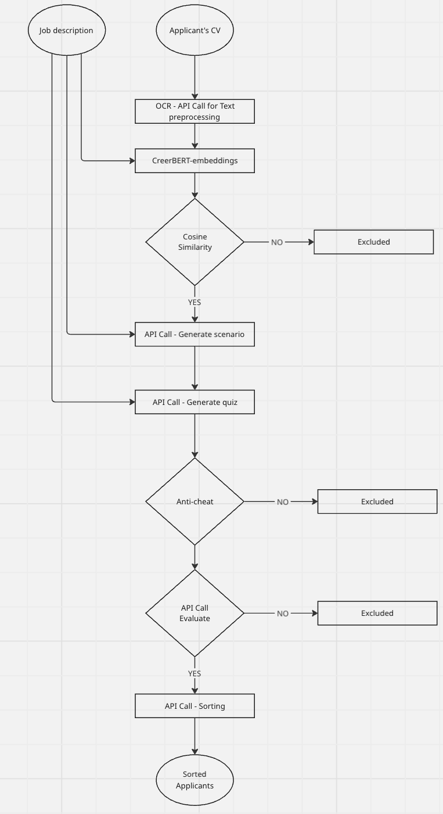

  
  <h1 style="display:inline;">Nukhbah Recruit</h1>

**AI-Powered Recruitment Platform for Smarter Hiring Decisions**

---

## 🚩 Problem  

In the tech field, evaluating candidates goes far beyond assessing soft skills — it requires specialized technical evaluation tailored to each specific role.  
Often, this process depends heavily on technical team members to assess candidates, making it time-consuming, inconsistent, and difficult to scale.  

**Nukhbah Recruit** was built to overcome this challenge by focusing exclusively on technology-based roles that demand deeper technical assessment.  
Our main focus areas include:  
- Software Engineering  
- Cyber Security  
- AI Engineering  
- Cloud Engineering  
- Full Stack Development  

---

## 💡 Solution  

**Nukhbah Recruit** automates the entire tech recruitment process using AI — from CV parsing to candidate ranking.  

**How it works:**  
1. **CV Extraction:** Automatically extracts and structures information from uploaded CVs.  
2. **Job Input:** HR submits job description, sector, and technical field.  
3. **Candidate Matching:** Uses embeddings and cosine similarity to find best-fit candidates.  
4. **Quiz Generation:** LLM generates a coding-based quiz tailored to the job, sector, and experience level.  
5. **Evaluation & Ranking:** The system evaluates solutions, scores performance internally, and ranks candidates for HR review.  

---

## 🧩 Nukhbah Recruit System Workflow  

Below is the end-to-end workflow of **Nukhbah Recruit**, showing how job descriptions and candidate CVs flow through the system to produce ranked results.

  

