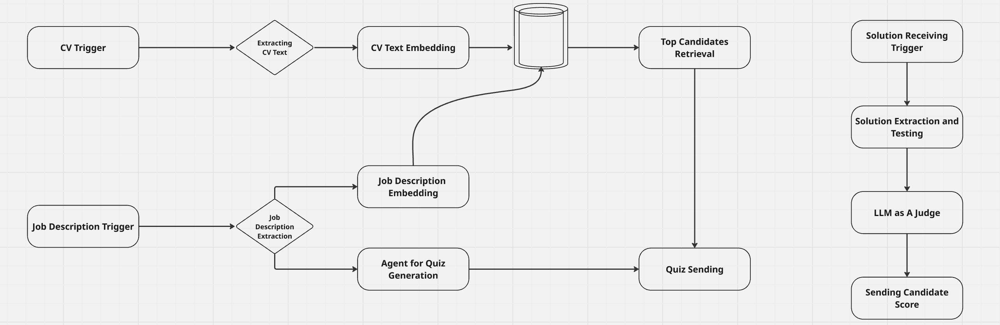

<p align="left">
  
  <h1 style="display:inline;">Nukhbah Recruit</h1>
</p>


**AI-Powered Recruitment Platform for Smarter Hiring Decisions**

---

## 🚩 Problem  

In the tech field, evaluating candidates goes far beyond assessing soft skills — it requires specialized technical evaluation tailored to each specific role.  
Often, this process depends heavily on technical team members to assess candidates, making it time-consuming, inconsistent, and difficult to scale.  

**Nukhbah Recruit** was built to overcome this challenge by focusing exclusively on technology-based roles that demand deeper technical assessment.  
Our main focus areas include:  
- Software Engineering  
- Cyber Security  
- AI Engineering  
- Cloud Engineering  
- Full Stack Development  

---

## 💡 Solution  

**Nukhbah Recruit** automates the entire tech recruitment process using AI — from CV parsing to candidate ranking.  

**How it works:**  
1. **CV Extraction:** Automatically extracts and structures information from uploaded CVs.  
2. **Job Input:** HR submits job description, sector, and technical field.  
3. **Candidate Matching:** Uses embeddings and cosine similarity to find best-fit candidates.  
4. **Quiz Generation:** LLM generates a coding-based quiz tailored to the job, sector, and experience level.  
5. **Evaluation & Ranking:** The system evaluates solutions, scores performance internally, and ranks candidates for HR review.  

---

## 🧩 Nukhbah Recruit System Workflow  

Below is the end-to-end workflow of **Nukhbah Recruit**, showing how job descriptions and candidate CVs flow through the system to produce ranked results.

<p align="left">
  
</p>


## Project Structure 

```bash
nukhbah-recruit/
│
├── candidate_answers_input/         #Candidate quiz submissions grouped by job field
│   ├── ai_engineer/
│   ├── cloud_engineer/
│   ├── cyber_security/
│   └── software_engineer/
│
├── cv_extraction_output/            # Extracted data from uploaded CVs
│   ├── raw_text/
│   ├── structured_json/
│   └── all_extracted_cvs.json
│
├── prompt_testing_data/             # Sample data for testing job fields that require data input
├── src/                             # Main source code for model, quiz, and evaluation
│   ├── app.py                       # FastAPI application
│   ├── candidate_answers.py         # Handles candidate responses
│   ├── candidate_matching.py        # Matching logic using embeddings
│   ├── cv_extractor.py              # CV parsing and text preprocessing
│   ├── generate_gpt_quiz.py         # Quiz generation using LLM
│   ├── evaluate_quiz.py             # Quiz evaluation
│   ├── evaluataion_config.py        # Evaluation configuration
│   ├── evaluation_criteria.py       # Candidates scoring and evaluation criteria
│   ├── job_desc_samples.py          # Sample job descriptions for testing
│   ├── prompts.json                 # Base prompts used for quiz generation
│   └── test_evaluation.py           # Unit tests for quiz evaluation
│
├── infra/                           # Infrastructure setup
│
├── static/                          # Static assets (Nukhbah Recruit logo, Workflow diagram)
│
│
├── main.py                          # Main entry point to run the pipeline
├── config.py                        # Configuration file for environment variables
├── requirements.txt                 # Python dependencies
├── Dockerfile                       # Docker setup for the FastAPI app
└── README.md                        # Project documentation
